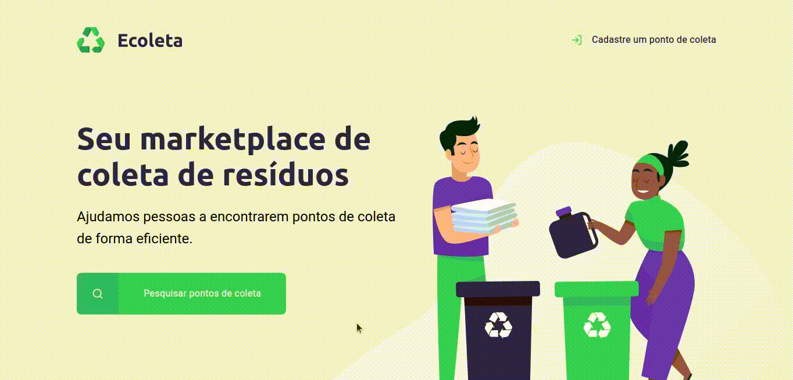
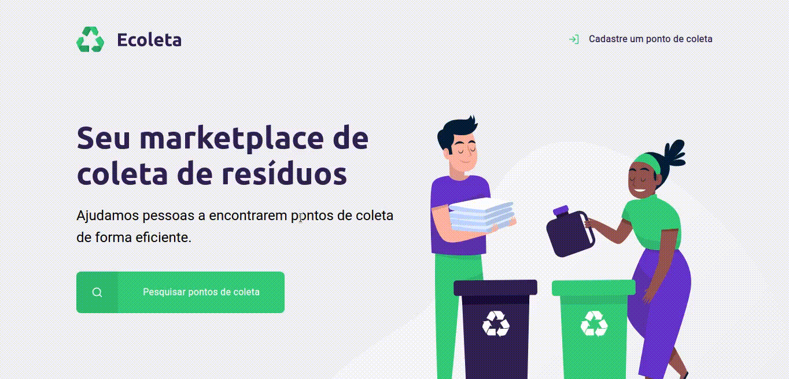

<h1 align="center">
  
</h1>

<p align="center">
  
  
   
  
  
  
  
  <a href="https://github.com/gabrielvieira1/NextLevelWeek/blob/master/LICENSE" target="_blank">
    
  </a>
  
  <a href="https://www.linkedin.com/in/bielvieira/" target="_blank">
    
  </a>
  
  <a href="https://twitter.com/bielvieir4" target="_blank">
   
  </a>
</p>

<p align="center">
  <a href="#-about-the-project">About the project</a>&nbsp;&nbsp;&nbsp;|&nbsp;&nbsp;&nbsp;
  <a href="#-layout">Layout</a>&nbsp;&nbsp;&nbsp;|&nbsp;&nbsp;&nbsp;
  <a href="#-technologies">Technologies</a>&nbsp;&nbsp;&nbsp;|&nbsp;&nbsp;&nbsp;
  <a href="#-how-to-install">How to install</a>&nbsp;&nbsp;&nbsp;|&nbsp;&nbsp;&nbsp;
  <a href="#-how-to-contribute">How to contribute</a>&nbsp;&nbsp;&nbsp;|&nbsp;&nbsp;&nbsp;
  <a href="#memo-license">License</a>
</p>

## 💻 About the project
<strong>Ecoleta</strong> is a project developed based on international environment week. That aims to connect people to companies that collect specific waste such as light bulbs, batteries, cooking oil, etc. 

## 🔖 Layout

<h1 align="center">
    
</h1>

<h1 align="center">
    
</h1>

## 🚀 Technologies

This project was developed with the following technologies:

- [Node.js](https://nodejs.org/en/)
- [npm](https://www.npmjs.com/)
- [vs](https://code.visualstudio.com/)
- [Express](https://expressjs.com/pt-br/)
- [Nunjucks](https://mozilla.github.io/nunjucks/)
- [SQLite](https://www.sqlite.org/index.html)
- [nodemon](https://nodemon.io/)
- [IBGE API for address consumption](https://servicodados.ibge.gov.br/api/docs/localidades?versao=1#api-UFs-estadosGet)

## 🔥 How to install

```bash
# Clone this repository
$ git clone https://github.com/gabrielvieira1/NextLevelWeek.git

# Go into the repository folder and install dependencies
$ cd NextLevelWeek && npm install

# Run
$ npm run start
```

## 🤔 How to contribute

- Make a fork;
- Create a branck with your feature: `git checkout -b my-feature`;
- Commit changes: `git commit -m 'feat: My new feature'`;
- Make a push to your branch: `git push origin my-feature`.

After merging your receipt request to done, you can delete a branch from yours.

## :memo: License

This project is under the MIT license. See the [LICENSE](LICENSE) for details.


Made with ♥ by Gabriel Vieira :wave: [Get in touch!](https://www.linkedin.com/in/bielvieira/)
